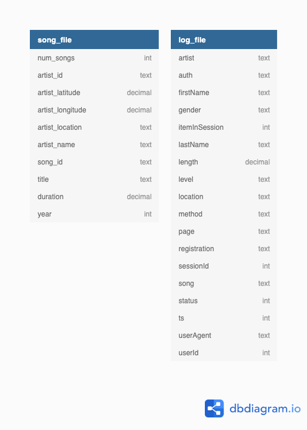
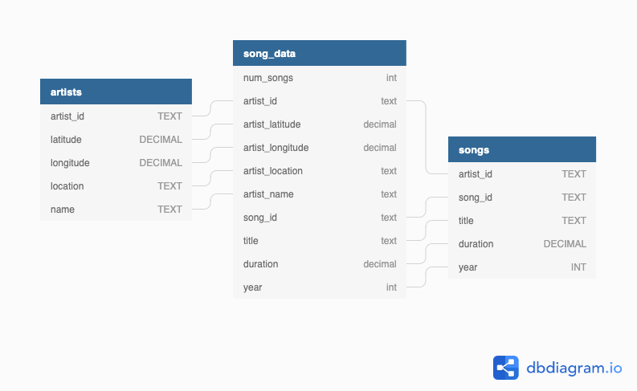
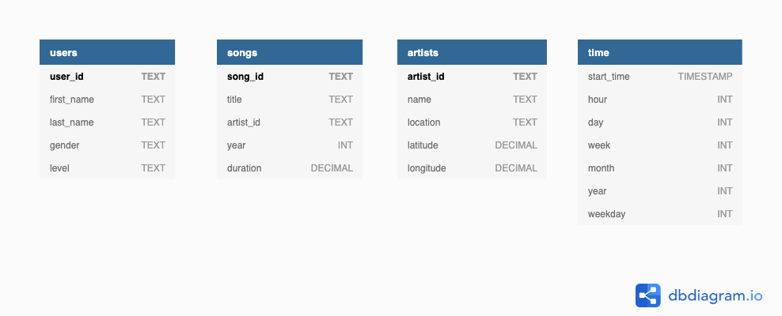
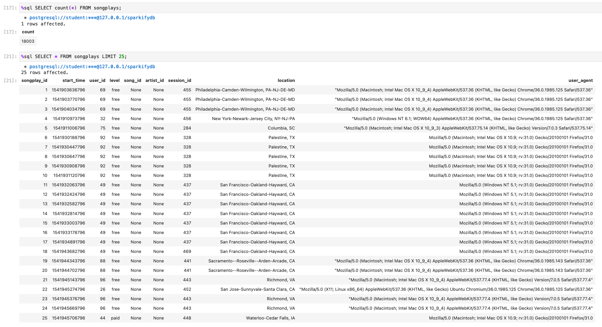

# Modeling Data with PostgreSQL

### Table of Contents
- Introduction - purpose of project, What is Sparkify, how this project is going to help it.
- Database schema design and ETL process
- Files in repository
- How to run the python scripts

### Introduction: Sparkify and user data.

Sparkify is a (fictional) startup that offers music streaming services. They accumulate 
data but do not yet leverage them. My job documented in this repository is to build an
ETL pipeline. Data are stored in json. I have created an SQL data model which is 
explained below.

In order to perform the ETL process, I will use Python to extract data from json files, 
transform the data with Pandas and finally upload the data to postgres using Psycopg2. 

With the data model and the Sparkify will have the ability to perform several analyses.
For instance, Sparkify will gain the ability to understand which songs are being played
the most, which OS and browser their users use or how the distribution between free
and paid users is.

Now that we have learned more about Sparkify, I will present more details about the
data in the next chapter.

### Database Schema Design and ETL Process

The data is now stored in multi line delimitied json files inside the folder `data`.
The original data can be split up into two tables: `song_file_data` and `log_file_data`.
The following diagram shows the original data:

#### The original data is stored in two tables 


On the one hand, I will split the data from `songs_file_data` to two dimension tables, 
namely to the `artists` table and the `songs` table. On the other hand, `log_file_data`
will become the `users` table and the `time` table.

#### song_data transforms into the tables "artists" and "songs"



#### log_data transforms into the tables "users" and "time"


The four tables will represent the dimension tables.

#### Dimension Tables

Based on the two original tables are the four dimension tables. The following
diagram shows all four dimension tables. These four tables will exist in postgres,
the code in this repository will upload the data to postgres.



In the center of the dimension table will be the fact table. together, these form
a star schema.

#### The Facts Table "Songplays" and the Star Schema

The `songplays` table is in the center of the four dimension tables. It gets it's
data from the original `log_data` as well as the `user_id` from the `users` and the 
`artist_id` from the `artists` table. The `songplays` table references every dimension 
table with a corresponding foreign key. The following diagram depicts the relation
of every column of the facts table:


The following image shows sample data of the `songplays` facts table:



Note: Normally, the columns "song_id" and "artist_id" would be NOT NULL. However,
the original data is limited. Thus, there are many rows that have null values for
the "song_id" and "artist_id".

#### Justification, benefit and analysis

With the facts table, sparkify has now many uses for business analysis. Here are some questions that can
be answered now:

- What songs are being played the most?
- What is the preferred time for songplays?
- What browser / operating system are being used?
- What is the distribution between free and paid users?

These additional information will enable sparkify to leverage data and make use of it. 

### Files in this repository

There are four folders in this repository.

- __data__ holds the original data.
- __notebooks__ holds all jupyter notebook. These are files ending in `ipynb`.
- __src__ holds the python scripts that perform the ETL process. 
- __documentation__ contains pictures, screenshots, diagrams, etc.

Inside __notebooks__ you will find three files. Here is a brief explanation of 
the notebooks:

- `etl.ipynb` walks through the ETL process and explains the steps. 
- `explore_data.ipynb` is a means to explore all five postgres tables.
- `test.ipynb` tests if all tables have been successfully created.

Inside __src__ you will find five files upon which this project depends. Here is
a short introduction to these scripts:

- `TableProperties.py` defines the class TableProperties. This class
  builds objects that have properties such as `songs_tableproperties.columns`.
- `sql_queries.py` holds every SQL query that is necessary for this project.
- `create_table.py` deletes all tables and creates them again (without rows). 
- `etl.py` is a programmatic representation of `etl.ipynb`.  
- `etl_david.py` refactors `etl.py` to improve readability and stability.

### How to run the python scripts

Make sure that the machine that runs the scripts have Postgres installed and available.
It's important that the directory `src/` is set to the root. So either make sure to
run the scripts with PYTHONPATH set or make sure to change `sys.path[0]`.

As soon as you fulfill these two requirements, you can run `etl_david.ipynb`. This
script will create all tables and populate the data from `data/`.

```bash
PYTHONPATH="~/path/to/folder/src/:$PYTHONPATH" python3 <script_to_execute>
PYTHONPATH="~/dev/repos/postgres_data_modeling/src/:$PYTHONPATH" python3 etl_david.py
```